# Discussion Sep 10

## 1 Experiment Settings

| 6-node graph                  | 8-node graph                  |
| ----------------------------- | ----------------------------- |
| 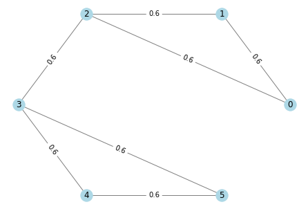 | 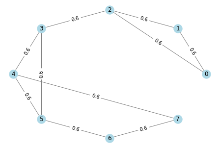 |

### 1.1 Generate $\mathbf{y}$ from exact graph $\mathbf{L}$ 

Given $\mathbf{y}|\mathbf{x},\mathbf{L}\sim \mathcal{N}(\mathbf{0},\sigma^2\mathbf{I}), \mathbf{x}|\mathbf{L}\sim\mathcal{N}(\mathbf{0},\mathbf{L}^\dagger)$, Generate $\mathbf{y}|\mathbf{L}\sim \mathcal{N}(\mathbf{0}, \sigma^2\mathbf{I}+\mathbf{L}^\dagger)$. $\mu=\sigma^2$

Total number: 128

### 1.2 Generate graphs from signals and places

- Use **learnable embeddings** for each node: $\tilde{\mathbf{e}}_i=[x_i,\mathbf{e}_i]$.
- Linear layer + leakyReLU(0.2): $\mathbf{f}_i = \sigma(\mathbf{H} \tilde{\mathbf{e}}_i+\mathbf{h})$.
- Weights and Laplacian matrix: $w_{i,j}=\alpha\exp(-\Vert\mathbf{f}_i - \mathbf{f}_j\Vert_2^2), \mathbf{L}^o=\text{diag}(\mathbf{W1}-\mathbf{W})$.

### 1.3 GEM flow

1. $\mathbf{W}^{(k)} = \mathbf{W}^{o(k)}\circ \mathbf{S}^{(k)}$
   - *Scaling:* $\alpha^{(k)} = \sqrt{c}/\Vert\mathbf{W}^{(k)}\Vert_F$, $\mathbf{W}^{o(k)}\leftarrow \alpha^{k}\mathbf{W}^{o(k)}$.
2. **(E-step)** 
   - Update $\mathbf{x}$: $\mathbf{x}^{(k)}=(\mathbf{I}+\mu\mathbf{L}^{(k)})^{-1}\mathbf{y}$
   - Recompute and rescale graph: $\mathbf{W}^{o(k')}=$`GraphLearningModule`$(\mathbf{x^{(k)}}|\Theta^{(k)})$, $\mathbf{W}^{(k')} = \mathbf{W}^{o(k')}\circ \mathbf{S}^{(k)}$ , $\alpha=\sqrt{c}/\Vert \mathbf W^{(k')}\Vert_F$, $\mathbf{W}^{o(k')}\leftarrow\alpha^{k'}\mathbf{W}^{o(k')}$
3. **(M-step-1)** update $\mathbf{L}^o$: 
   - gradient: $\nabla_\Theta (\mathbf{x}^\top\mathbf{L}^{(k')}\mathbf{x} )$, compute with `torch.autograd.grad`
   - gradient descent: $\Theta^{(k+1)} = \Theta^{(k)}-\delta^{(k)}\nabla_\Theta$
   - New graph: $\mathbf{W}^{o(k+1)}=$`GraphLearningModule`$(\mathbf{x^{(k)}}|\Theta^{(k+1)})$ 
   - *Scaling:* $\alpha^{k+1}=\sqrt{c}/\Vert \mathbf{W}^{o(k+1)}\circ \mathbf{S}^{(k)}\Vert_F$, $\mathbf{W}^{o(k+1)}\leftarrow\alpha^{k+1}\mathbf{W}^{o(k+1)}$
4. **(M-step-2)** update $\mathbf{S}$: 
   - Compute $\tilde{Q}_{i,j}^{(k+1)} = \frac{(W_{i,j}^{o(k+1)})^2}{\frac{1}{2}W_{i,j}^{o(k+1)}(x_i-x_j)^2+\gamma}$, sort in *descending order*, 
   - fill $S_{i,j}^{(k+1)}$ one by one until reaches energy limit $\|\mathbf{W}^{o(k+1)}\circ\mathbf{S}^{(k+1)}\|=c$. 
   - Scale:  $\alpha^{k'+1}=\sqrt{c}/\Vert \mathbf{W}^{o(k+1)}\circ \mathbf{S}^{(k+1)}\Vert_F$, $\mathbf{W}^{o(k+1)}\leftarrow\alpha^{k'+1}\mathbf{W}^{o(k+1)}$

## 2 Demo Results

6-node graphs: noise $\sigma=0.1$, Original graph $\|W_{\text{truth}}\|_F^2=5.04$. 	Parameters: $\mu=0.01, \gamma=0.1, \delta=0.005, c=5$

| Step 1                | Step 2                | Step 3                | Step 4                | Step 5                |
| --------------------- | --------------------- | --------------------- | --------------------- | --------------------- |
| 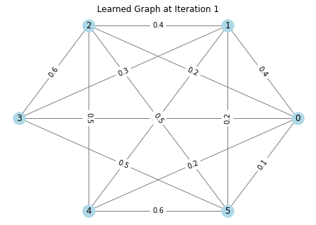 | 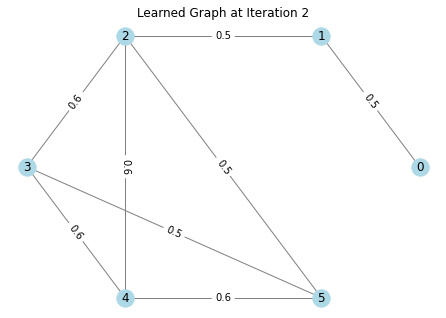 |  | 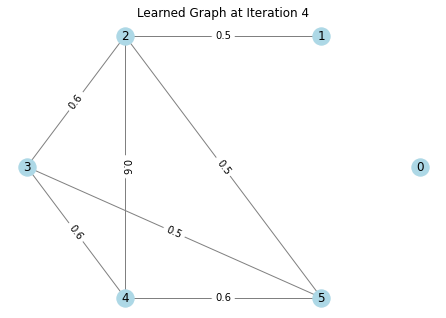 | 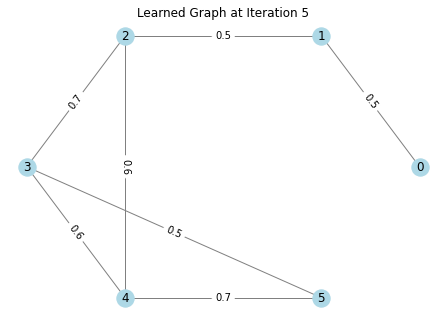 |

8-node graphs: noise $\sigma=0.5$, Original graph $\|W_{\text{truth}}\|_F^2=7.2$. 	Parameters: $\mu=0.25, \gamma=0.1, \delta=0.08, c=8$

| Step 1                | Step 2                | Step 3                | Step 4                | Step 5                |
| --------------------- | --------------------- | --------------------- | --------------------- | --------------------- |
| 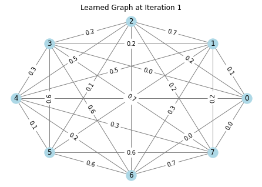 | 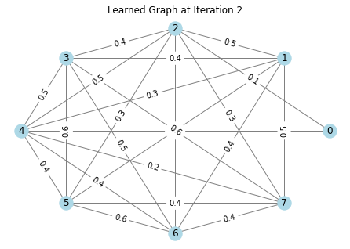 | 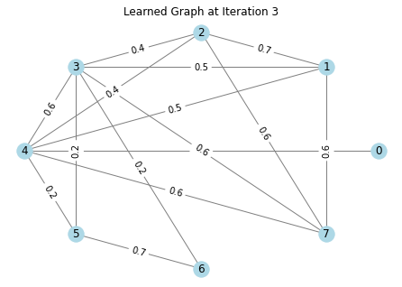 | 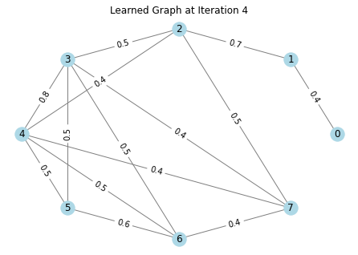 | 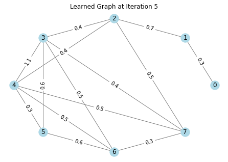 |

## 3 Sensitivity to parameters

## 4 Unrolling model

