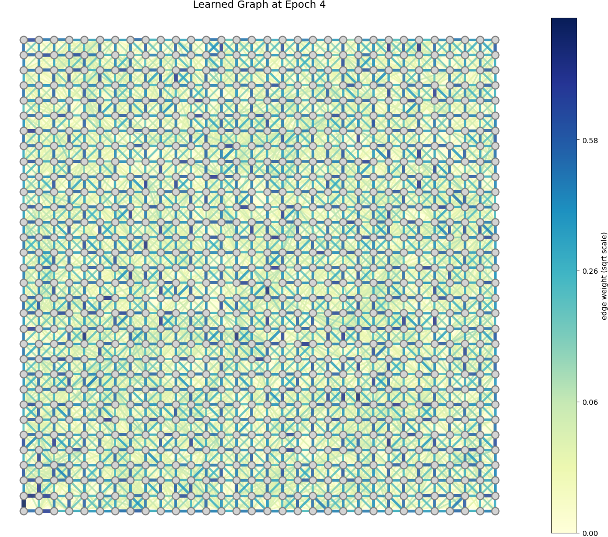
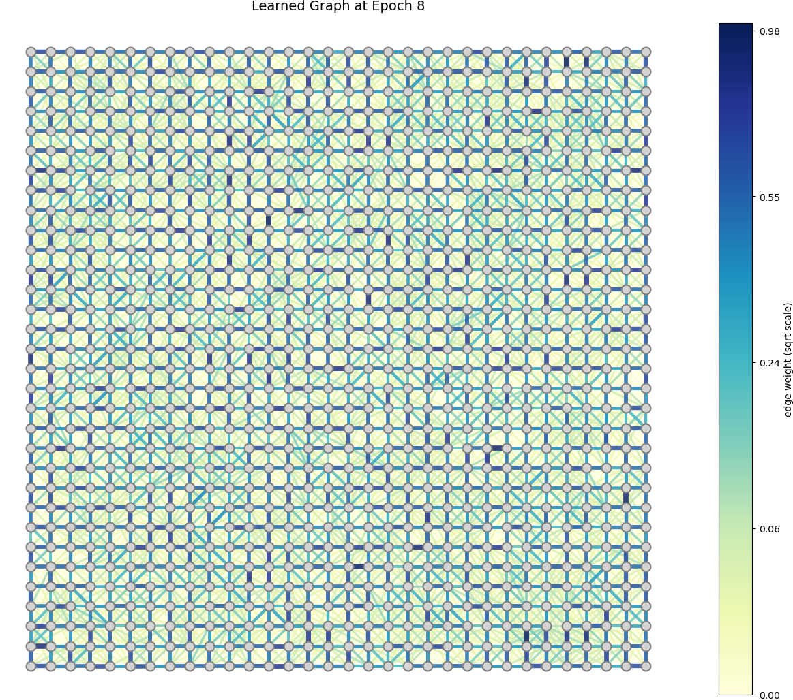

# Discussion Jan 19

## 1 Memory cost of unrolling implementation

Parameterization: GLR filter strength $\mu$, $\ell_0$ penalty strength $\gamma$, CG/PCG parameters $\alpha, \beta$. 

- $N_{GEM}$ iterations of GEM algorithm, $N_{PGD}$ iterations of PGD, $N_{CG}$ iterations of $CG$
- different $\mu$ in different GEM iterations, different $\gamma$ in different PGD/GEM, different $\alpha, \beta$ in different CG

Parameter size and memory cost: **Only 1 graph**. $32\times 32$ input, `batch_size=8`, on NVIDIA GeForce RTX 3090

| GEM iterations | Enable 2nd order gradients | PGD iterations | CG iterations (inv) | CG iterations (E step) | Params\# | Memory(MB) | Time Cost per Batch (s) |
| -------------- | -------------------------- | -------------- | ------------------- | ---------------------- | -------- | ---------- | ----------------------- |
| 3              | T                          | 5              | 4                   | 3                      | 8423     | 19038      | 1.24                    |
| 3              | F                          | 5              | 4                   | 3                      | 8423     | 8964       |                         |
| 3              | T                          | 5              | 3                   | 3                      | 8397     | 14300      | 0.91                    |
| 3              | T                          | 4              | 4                   | 3                      | 8406     | 15506      | 1.04                    |
| 3              | T                          | 5              | 4                   | 2                      | 8427     | 19022      | 1.23                    |

**Problem:** No edges have been cut within 3 iterations of GEM unrolling. (edges left: 11346/11346)

Unrolling a GEM algorithm is not suitable?

## 2 Alternative model: GEM-style training of GNN

- key idea: train a GNN while cutting the edges
- application 1: neuron science---find the connections between two neurons ($10^5$ neurons in total, normally done by causal inference)
  - Problem: directed graph modeling; directed graph LASSO under what assumption?
  - Application of GMRF-based modeling: **"correlations" instead of "causality"**. Marketing?

$32\times 32$ nodes, `batch_size=64`, 12022MB

- 4 epochs (6888 / 11346 edges)

  

- 8 epochs (6937 / 11346 edges)

  

  